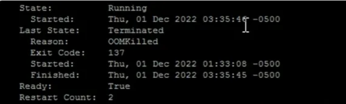
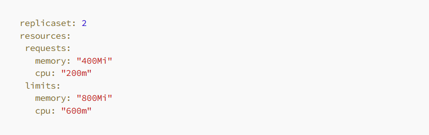
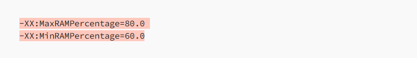
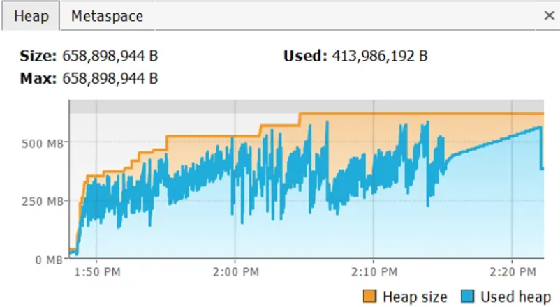
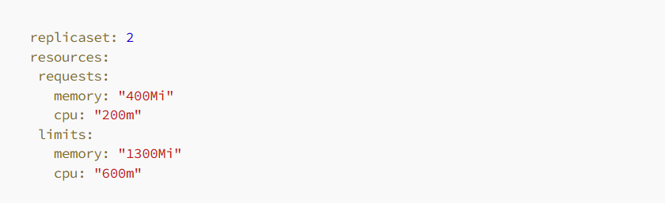
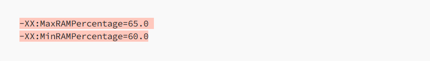
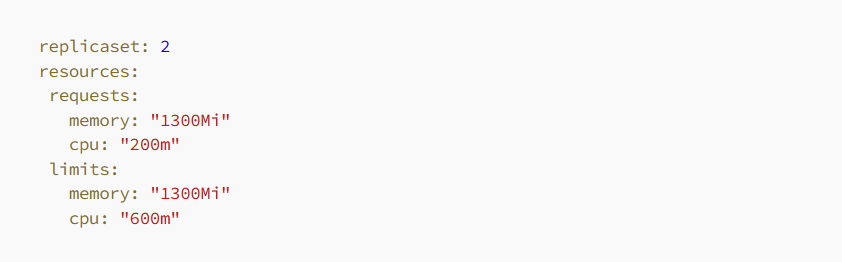

We encountered an issue with our Java Spring boot application where the kuberenets pods were getting killed or restarted with an OOMKilled error and an Exit Code of 137.

  Reason for pod being killed.

Now, first let’s talk about what is OOMKilled(Exit Code: 137)

When a container is OOMKilled, it means that it has consumed more memory than its specified memory limit,
causing a severe resource constraint. The Kubernetes control plane or container runtime, such as Docker,
recognizes this condition and forcefully terminates the container to prevent it from consuming excessive
resources and potentially impacting other containers or the overall system stability.

So, I will walk through the configurations we had when we faced this issue.

Our pod memory configuration looks like

And as we are using java spring boot with amazoncorretto:8 docker image, so our JVM arguments we were using to run this spring boot application is

So, let me explain the configurations. In our Kubernetes pod, we allocated an initial memory of approximately 400MB and a maximum memory of 800MB. Additionally, within our Java application, we controlled the heap memory to utilize only 80% of the allocated memory. For instance, out of the total 800MB available to the Java application, it could only utilize up to 640MB.

Now, let’s discuss the nature of our application. The application primarily involves heavy processing tasks that require a significant amount of memory. It operates under a stable load within specific time periods, as we trigger events using a designated cron job. This consistent workload contributes to the memory usage patterns and requirements of our application.

So, whenever we deploy our application, the memory usage gradually increases over time until it reaches the allocated limit of 80% of the total memory. As the application approaches this threshold, the JVM’s garbage collector automatically initiates the process of freeing up memory by reclaiming unused objects and resources. This behavior is the default setting of the JVM, as it strives to utilize the allocated memory to its fullest extent, ultimately enhancing overall application performance.

One thing we were sure that it is not java OutOfMemory Exception issue, because we weren’t seeing any error either in console logs or in our VisualVM monitoring tool. And we were monitoring pod memory size.

You can see below VisualVM snapshot for heap memory status

  Heap memory usage

As there was no issue with the application itself, we attempted to resolve the problem by increasing the memory limit of the pod from 800MB to 1000MB. With this new configuration, we allocated 800MB to the application’s heap. However, to our dismay, we encountered OOMKilled errors once again. Undeterred, we further increased the pod’s memory limit to 1200MB, resulting in a heap size of 960MB. Unfortunately, the OOMKilled errors persisted. We made yet another adjustment, increasing the pod’s memory to 1500MB and allocating 1200MB to the heap. Regrettably, the application continued to experience OOMKilled errors.

As observed, regardless of the memory we provided, the application consumed all available memory without restraint. This behavior was expected, as previously mentioned, since the JVM aims to utilize the maximum allocated memory for optimal performance.

After much contemplation and exploration, we made a crucial discovery. It dawned upon us that our application was not the sole occupant within the pod.
We realized that we were utilizing the Amazon Corretto provided JAVA Docker image to run our application.
<mark> This Java image required a substantial amount of memory, exceeding 300MB, to perform certain background tasks related to Java itself.</mark>

Upon further analysis, we realized that with a 1GB pod memory limit, 800MB was allocated to our application, leaving a mere 200MB for the Amazon Corretto Java runtime. As a result, the Java runtime exhausted all available memory, causing the pods to restart repeatedly.

This revelation shed light on the root cause of the OOMKilled errors we were facing. The imbalance in memory allocation between our application and the Java runtime was leading to inadequate resources for the runtime to perform its essential tasks effectively.

So, we tweak our Configurations

Pod memory configurations -

JVM arugments -

You can see with this new configuration we are giving application to use 845mb and remaining 455mb can be used by Amazon Corretto image, which was actually sufficient. And we never got OOMKilled issue again.

To optimize the configuration, we decided to set the pod memory request and limit to the same value. Since we knew that our application required approximately 845MB of memory, we allocated this amount upfront. By doing so, we ensured that the application had exclusive access to the allocated memory without any other pods encroaching upon its resources.

And that’s how we successfully resolved our problem! This experience taught us the importance of thorough investigation and considering all aspects of our environment. Sometimes, the solution lies not within our own application, but in the surrounding components or dependencies.

