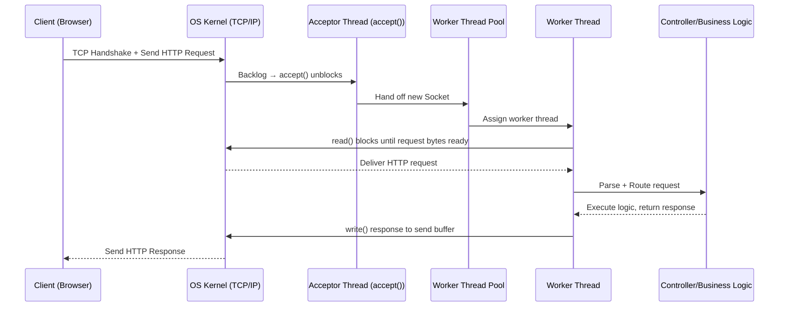
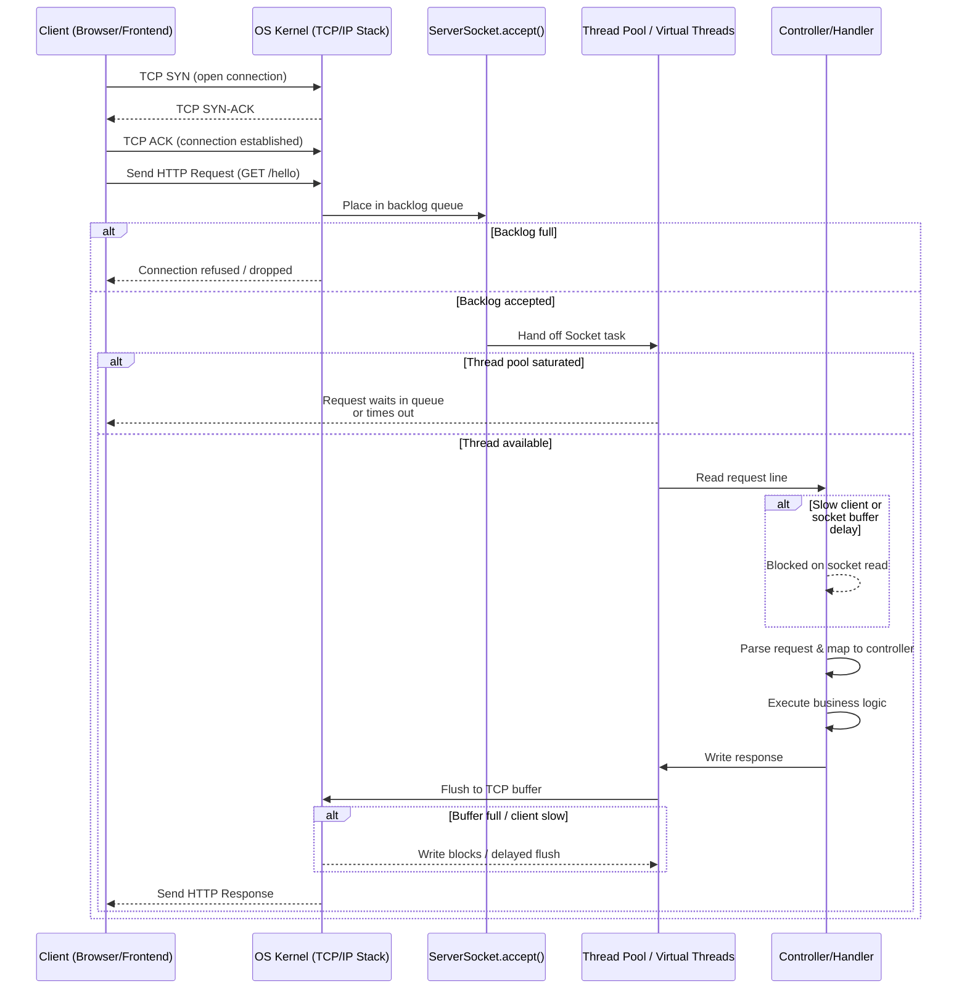

<hr />

I wanted to understand what actually happens between clicking a button in the browser and my controller method executing.
<br />
To explore this, I built a simple HTTP server in Java using raw sockets and implemented parts of the HTTP protocol from scratch.

## Understanding the request lifecycle

1. The request first reaches the operating system, not the application. The OS kernel handles the TCP handshake and temporarily stores the connection.
2. Once the TCP handshake is completed, the connection does not immediately reach the application. Instead, the operating system places it in a **backlog queue** associated with the listening socket.
<div class="note-text">
This backlog acts as a waiting area between the network layer and the application.
The server thread calling `accept()` is responsible for picking connections from this queue.
If the application is busy and does not call `accept()` fast enough, new connections start accumulating here.
This is one of the first hidden bottlenecks in server systems.
If the backlog becomes full, new incoming connections may be dropped even before your application is aware of them.
</div>

3. Java provides ServerSocket API to abstract away the low-level details of TCP. Along with backlog size.

```java
int port = 8080;
ServerSocket serverSocket = new ServerSocket(port, 20);
```

4. The application thread blocks on `accept()` waiting for connections.

```java
Socket clientSocket = serverSocket.accept();
```

This is the exact point where the kernel hands over a fully established TCP connection to the application.

5. Once `accept()` returns a socket, the connection is now fully inside the application layer.

At this point, the server must handle the request lifecycle:
- read HTTP request
- parse request line and headers
- execute business logic
- send response back

6. Instead of processing the request inside the accept loop, the socket is handed off to a worker thread.
This allows the accept loop to immediately go back and wait for new connections.
```java
executorService.execute(() -> handleClient(clientSocket));
```

7. Now the worker thread takes over the connection.
And handleClient method represents the full lifecycle of request processing for one client.

Now let’s put everything together and visualize the complete lifecycle of an HTTP request in a blocking server.



<p>
What looks like a simple controller execution is actually a long chain of OS-level and application-level operations involving queues, threads, and the TCP stack.
</p>

<hr />

<p>
Here is another depth diagram showing the same lifecycle but with more details on the OS and application interactions.
</p>




<hr />

## Source Code of Raw HTTP Server

The complete implementation of this raw HTTP server is available here:

https://github.com/sats17/under-the-hood-webserver/blob/master/src/thread_per_request/RawServer.java
