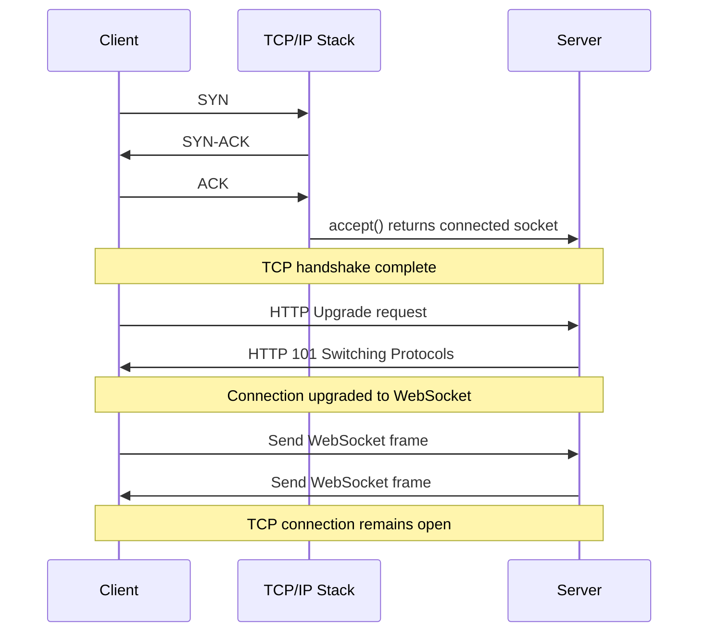

<hr />

I built a minimal WebSocket server and client in Java using raw sockets and implemented parts of the WebSocket protocol manually.

## Understanding the WebSocket lifecycle
1. Just like HTTP, a WebSocket connection first begins with a normal TCP handshake handled entirely by the operating system.

     <br /> The application is not involved yet.
     <br /> The OS kernel:

     - receives SYN packets
     - completes the TCP 3-way handshake
     - places the connection into the listening socket backlog queue

     <br /> Only after this does accept() unblock.
     ```java
      Socket clientSocket = serverSocket.accept();
     ```

2. Once the application accepts the socket, the client sends an HTTP Upgrade request. Unlike normal HTTP, the client requests protocol switching:
    ```http
    GET /chat HTTP/1.1
    Host: localhost:8082
    Upgrade: websocket
    Connection: Upgrade
    Sec-WebSocket-Key: ...
    Sec-WebSocket-Version: 13
    ```
    This is one of the most important things to understand about WebSockets:
    <br />They do not replace HTTP initially.
    Instead, they begin as HTTP and then negotiate a protocol switch.

3. The server reads the incoming HTTP headers manually.
    ```java
    String line;
    String secKey = null;

    while ((line = in.readLine()) != null && !line.isEmpty()) {
        if (line.startsWith("Sec-WebSocket-Key:")) {
            secKey = line.split(":")[1].trim();
        }
    }
    ```
    At this point:
    - the connection is still behaving like HTTP
    - the server is parsing plain text headers
    - no Websocket frames exist yet
   The critical header here is:
   ```http
   Sec-WebSocket-Key
   ```

4. The server now computes Sec-WebSocket-Accept.
   The WebSocket protocol defines a fixed GUID:
   ```java
    String magicString = "258EAFA5-E914-47DA-95CA-C5AB0DC85B11";
   ```
   The server:
    - concatenates the client key with this GUID
    - computes SHA-1 hash
    - Base64 encodes the result
    ```java
    String acceptSeed = secKey + magicString;

    MessageDigest md =
    MessageDigest.getInstance("SHA-1");

    byte[] sha1 =
    md.digest(acceptSeed.getBytes(StandardCharsets.UTF_8));

    String acceptKey =
    Base64.getEncoder().encodeToString(sha1);
    ```
   This mechanism ensures that:
    - the client intentionally requested a WebSocket upgrade
    - the server understands the WebSocket protocol

5. If validation succeeds, the server responds with HTTP 101.
    ```http
    HTTP/1.1 101 Switching Protocols
    Upgrade: websocket
    Connection: Upgrade
    Sec-WebSocket-Accept: ...
    ```
   At this point:
    - the protocol switch is complete
    - the connection is now a WebSocket connection
    - both client and server will interpret bytes as WebSocket frames from now on

Unlike normal HTTP request-response lifecycles, the connection is now persistent.

<hr />

Now let’s visualize the complete lifecycle at a high level.


<p> One important detail here is that WebSockets do not replace TCP. The same TCP connection remains alive throughout the lifecycle. Only the application-layer protocol changes from HTTP to WebSocket. </p> <hr />

## Understanding WebSocket frames

Once the protocol upgrade succeeds, communication no longer happens using HTTP requests and responses. <br />
Instead, both sides exchange binary WebSocket frames over the same TCP connection. <br />

The server enters a continuous frame-reading loop:

```java
while (true) {
    int b1 = is.read();
    if (b1 == -1) break;

    int b2 = is.read();
    if (b2 == -1) break;
}
```
Unlike HTTP:

  - there are no request lines
  - no headers
  - no content-length parsing

The protocol becomes a lightweight binary framing protocol.
<div class="note-text"> A WebSocket connection is fundamentally still a TCP connection. The protocol only changes how bytes are interpreted after the HTTP upgrade succeeds. </div>


## Reading frame metadata

The first byte contains metadata about the frame:
```java
int b1 = is.read();
```

This byte stores:
  - FIN bit
  - opcode
  - fragmentation information

The second byte contains:
 - MASK bit
 - payload length
```java
int payloadLen = b2 & 0x7F;
```
This is where the protocol becomes much more compact compared to HTTP.

## Client frames are masked

One interesting detail in the WebSocket specification is:

> Clients must always mask frames sent to servers.

The client generates a random 4-byte masking key:
```java
byte[] mask = new byte[4];
new Random().nextBytes(mask);
```
The payload bytes are XORed using this mask.
```java
for (int i = 0; i < payload.length; i++) {
    frame.write(payload[i] ^ mask[i % 4]);
}
```
The server reverses the masking operation:
```java
for (int i = 0; i < payloadLen; i++) {
    payload[i] =
        (byte) (payload[i] ^ mask[i % 4]);
}
```
This reconstructs the original message.
```java
String msg =
    new String(payload, StandardCharsets.UTF_8);
```
At this point, the server has successfully decoded a raw WebSocket frame manually.

<hr />

## Source Code of Raw WebSocket Server

The complete implementation of this raw WebSocket server and WebSocket client is available here:

https://github.com/sats17/under-the-hood-webserver/tree/master/src/websocket
