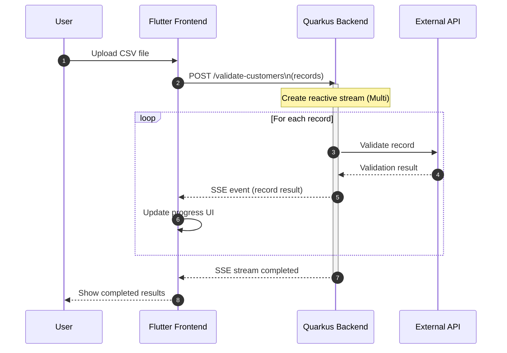
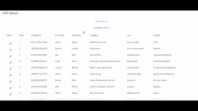

<hr />

## Problem statement

Consider a workflow where users upload a CSV containing device identifiers. The backend processes each record through
an external API and users need the results before moving to the next step.

A few constraints were already known:
- Maximum batch size: 100 records
- External API response times are unpredictable
- Results are independent
- Users remain on the same screen waiting for completion

The main question was not how to process the batch, but how to stream results back to users as they become available.

<hr />

## Approaches considered
1. **Multiple request from frontend to backend for each record** - Discarded due to more network trips and repetitive processing logic
2. **Single request with waiting for entire batch to complete** - Discarded due to unpredictable response times and poor user experience
3. **Queue based approach with polling** - Discarded due to added complexity for small batch sizes and need for real-time updates
4. **Server-Sent Events (SSE)** - Chosen for its simplicity, real-time streaming capabilities within single HTTP connection, and good browser support

## Why SSE fits this workflow
- Single upload request from frontend to backend
- Server pushes update progressively
- Fewer client round trips
- No polling
- No additional infrastructure
- Communication remains one-directional

## Request Flow



## Reactive SSE Implementation
### Backend
On backend we used Quarkus reactive programming model to implement. The main components were:
1. **REST endpoint** - A POST endpoint accepts the uploaded records as JSON and starts the validation process.
2. **Reactive processing pipeline** - Each record is processed independently using reactive streams.
   Instead of waiting for the entire batch to complete, every record is validated asynchronously and emitted immediately after processing.
3. **Server-Sent Events (SSE)** - The endpoint produces a continuous event stream using Server-Sent Events (SSE).
   As each record finishes processing, the backend pushes the result directly to the frontend in real time.

```java
    @POST
    @Path("/validate-customers")
    @Consumes(MediaType.APPLICATION_JSON)
    @Produces(MediaType.SERVER_SENT_EVENTS)
    @RestStreamElementType(MediaType.APPLICATION_JSON)
    public Multi<GenericValidationResponse> uploadCustomers(List<JsonNode> incomingData) {
        // Using JsonNode to handle dynamic JSON structure.
        System.out.println("Total Records Received: " + incomingData.size());
        return Multi.createFrom().iterable(incomingData)
                .onItem().transformToUniAndMerge(jsonNode -> {
                    int id = jsonNode.has("id") ? jsonNode.get("id").asInt() : 0;
                    // Mimicking processing time with a random delay
                    long delay = ThreadLocalRandom.current().nextLong(1000, 5000);
                    GenericValidationResponse response = new GenericValidationResponse(id, true);
                    return Uni.createFrom().item(response).onItem().delayIt().by(Duration.ofMillis(delay));
                });
    }

    public record GenericValidationResponse(int id, boolean validated) {
    }
```

<div class="note-text">
  Quarkus provides reactive primitives through mutiny. In this example, we create a Multi stream from the incoming list
  of records. Each record is processed asynchronously, and results are emitted as they become available.
  The @RestStreamElementType annotation ensures that each emitted item is sent as a separate SSE event to the client.
</div>

### Frontend
On the frontend we used flutter to consume the SSE stream. The main steps were:
1. **Initiate SSE connection** - When the user uploads the CSV, we send a POST request to the backend and establish an SSE connection to receive updates.
2. **Listen for incoming events** - We listen for incoming SSE events and update the UI in real time as results arrive.
```dart
  response.stream
          .transform(utf8.decoder)
          .transform(const LineSplitter())
          .listen((String line) {
              setState(() {
                // Update progress UI
              });
          });
```
<div class="note-text">
  The frontend listens to the SSE stream and updates the UI as each record is processed. This provides a responsive user experience without needing to wait for the entire batch to complete.
</div>

<hr />
This is how UI looks like when processing is in progress:
<br />



<hr />

## Production considerations

### Limiting Parallel API Calls
Although processing records in parallel can speed up the workflow, it can also overwhelm the external API. To mitigate
this, we can use a concurrency limiter to control the number of simultaneous API calls.
```java
return Multi.createFrom()
                .iterable(incomingData)
                .onItem()
                .transformToUni(DataValidateController::process)
                .merge(20); // Adjust the concurrency level as needed (e.g., 20 concurrent processing)
```

### Reverse Proxy and Buffering Issues
When deploying SSE behind reverse proxies such as Nginx or CloudFront, buffering can prevent events from reaching the client immediately.

For SSE to work correctly, buffering must be disabled so events are flushed progressively instead of being accumulated.

### Handling Client Disconnects
One important edge case is when the user closes the browser tab or navigates away while processing is still running.

Since SSE connections are long-lived HTTP streams, the backend should detect connection termination and stop unnecessary processing to avoid wasting resources.
```java
.onCancellation().invoke(() -> {
                    cancelled.set(true);
                    System.out.println("Client disconnected. Stopping batch processing.");
                });
```
This stops scheduling new work once the SSE connection closes. However, cancellation of already running API calls
depends on whether the underlying HTTP client supports reactive cancellation propagation.

<hr />

The implementation itself was fairly small. The more interesting part was to evaluate different approaches and choose
the one that best fits the workflow. SSE provided a simple and effective way to stream results back to users in real
time without adding unnecessary complexity.

<hr />

## References
- github repo with sample code:

https://github.com/sats17/quarkus-sse-batch-processing
