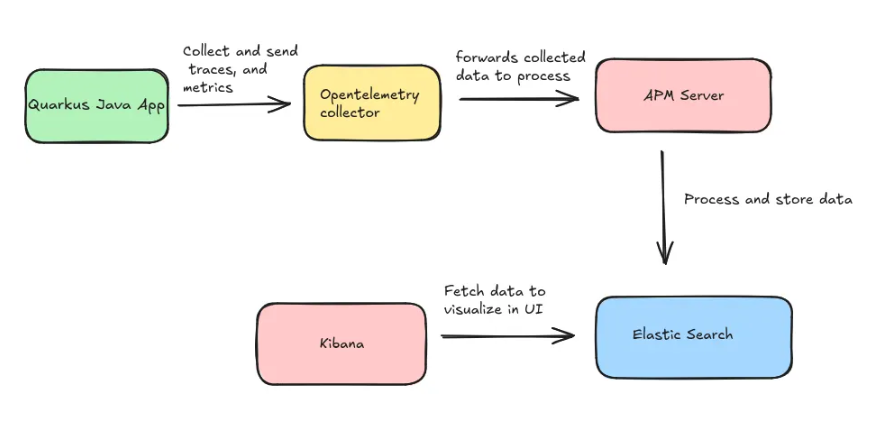
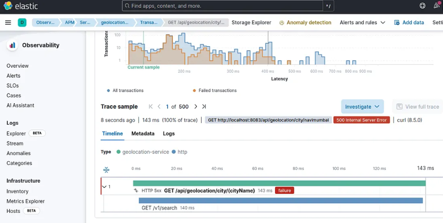
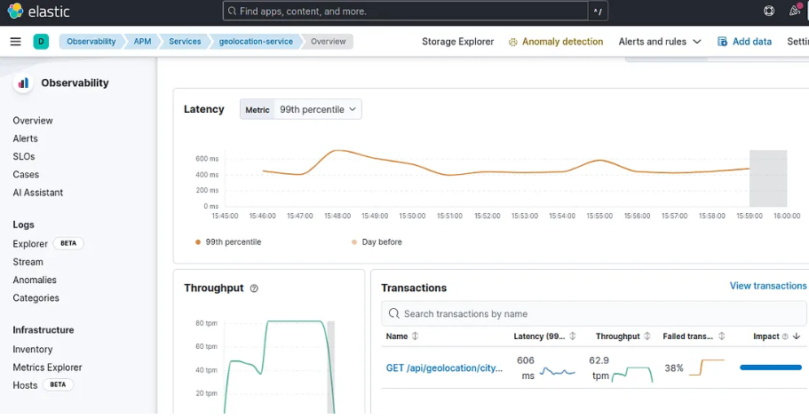
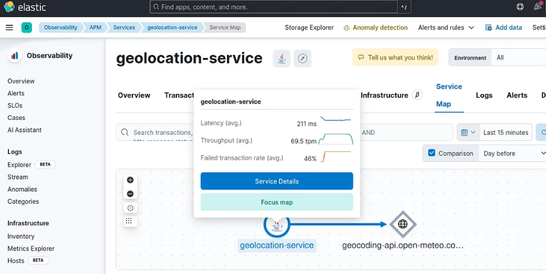

<hr />

In today’s microservices and cloud-native landscape, observability and monitoring is essential for maintaining system health, tracking request flows, and detecting issues early.

Tools like Elastic APM, Kibana, Prometheus, Jaeger, and Grafana provide the visibility and metrics you need to effectively monitor and optimize your applications.

In this post, I’ll focus on integrating Quarkus with OpenTelemetry to send traces and metrics to Elastic APM, and visualize them in Kibana.

<hr />

<div class="note-text">
Why Opentelemetry ?

OpenTelemetry standardizes the collection of traces, metrics, and logs, offering a vendor-neutral solution.
It allows easy switching between tools like Elastic APM and Prometheus, Grafana without changing your app, ensuring flexibility and future-proofing.
</div>

<hr />

Our setup flow will look like this


<hr />

#### Part 1: Opentelemetry, Elastic APM, Elasticsearch, Kibana setup

1. Refer below docker compose file, and create docker-compose.yml for setup.

```yaml
version: '3.8'

services:
  elasticsearch:
    image: docker.elastic.co/elasticsearch/elasticsearch:8.15.0
    container_name: elasticsearch
    environment:
      - discovery.type=single-node
      - xpack.security.enabled=false
      - "ES_JAVA_OPTS=-Xms512m -Xmx512m"
    ports:
      - "9200:9200"
    volumes:
      - es_data:/usr/share/elasticsearch/data
    networks:
      - elastic

  kibana:
    image: docker.elastic.co/kibana/kibana:8.15.0
    container_name: kibana
    ports:
      - "5601:5601"
    environment:
      - ELASTICSEARCH_HOSTS=http://elasticsearch:9200
    networks:
      - elastic

  # If APM Server with docker compose have issue with elastic search network connectivity.
  # Then use direct docker run command with same network.
  # sudo docker run -d   --name apm-server-2   --cap-add CHOWN   --cap-add DAC_OVERRIDE   --cap-add SETGID   --cap-add SETUID   --network monitor_infra_elastic   -p 8200:8200   -e ELASTIC_APM_SERVER_URL=http://elasticsearch:9200   -e ELASTIC_APM_KIBANA_URL=http://kibana:5601   -e ELASTIC_APM_RUM_ENABLED=true   docker.elastic.co/apm/apm-server:8.15.0   apm-server -e   -E apm-server.rum.enabled=true   -E setup.kibana.host=http://kibana:5601   -E output.elasticsearch.hosts=["http://elasticsearch:9200"]   -E apm-server.kibana.enabled=true   -E apm-server.kibana.host=http://kibana:5601
  apm-server:
   image: docker.elastic.co/apm/apm-server:8.15.0
   container_name: apm-server
   cap_add:
     - CHOWN
     - DAC_OVERRIDE
     - SETGID
     - SETUID
   networks:
     - elastic
   ports:
     - "8200:8200"
   environment:
     - ELASTIC_APM_SERVER_URL=http://elasticsearch:9200
     - ELASTIC_APM_KIBANA_URL=http://kibana:5601
     - ELASTIC_APM_RUM_ENABLED=true
   command: >
     apm-server -e
     -E apm-server.rum.enabled=true
     -E setup.kibana.host=http://kibana:5601
     -E output.elasticsearch.hosts=["http://elasticsearch:9200"]
     -E apm-server.kibana.enabled=true
     -E apm-server.kibana.host=http://kibana:5601


  otel-collector:
    # Custom OpenTelemetry Collector with Elasticsearch exporter support
    image: otel/opentelemetry-collector-contrib:latest
    container_name: otel-collector
    volumes:
      - ./otel-collector-config.yaml:/etc/otel-collector-config.yaml
    ports:
      - "4317:4317" # OTLP gRPC
      - "4318:4318" # OTLP HTTP
    command: ["--config", "/etc/otel-collector-config.yaml"]
    networks:
      - elastic

volumes:
  es_data:

networks:
  elastic:
    driver: bridge
```

2. You can see that we have four services (Elasticsearch, Kibana, APM Server, and the OpenTelemetry Collector), all communicating within the ‘elastic’ network.

3. Now create “otel-collector-config.yaml” within same directory.
```yaml
receivers:
  otlp:
    protocols:
      grpc:
        endpoint: "0.0.0.0:4317"
      http:
        endpoint: "0.0.0.0:4318"

processors:
  batch:
    timeout: 10s
    send_batch_size: 200

exporters:
  otlp:
    endpoint: "http://apm-server:8200"
    tls:
      insecure: true

service pipelines service:
  pipelines:
    metrics:
      receivers: [otlp]
      processors: [batch]
      exporters: [otlp]
    traces:
      receivers: [otlp]
      processors: [batch]
      exporters: [otlp]
```
  Here you can see we have 4 components:
  - **receivers**         — Using this protocols our quarkus application can communication to otel-collector.
  - **processors**        — Applies transformations or batching to telemetry data before it’s sent, optimizing performance and delivery.
  - **exporters**         — Sends the processed telemetry data to the destination system, such as Elastic APM or another observability platform like prometheus or jaeger.
  - **service pipelines** — Defines the flow of telemetry data through the system, from collection (receivers) to processing and finally to exporting.

4. Now, run the command below to create your infrastructure in the background.
```bash
docker-compose up -d
```

5. You can check that the Kibana server will be running on localhost:5601

#### Part 2: Quarkus application setup

"For quick start you can clone this repository."
https://github.com/sats17/java-observability-stack/tree/main/geolocation-service

1. Add opentelemetry dependency in pom.xml
```xml
<dependency>
  <groupId>io.quarkus</groupId>
  <artifactId>quarkus-opentelemetry</artifactId>
</dependency>
```
“You can also try auto-instrumentation with the OpenTelemetry Java agent jar, but the official Quarkus documentation recommends using OpenTelemetry as part of the Quarkus extension.”

2. Add below properties in application.yaml or application.properties file
```yaml
quarkus:
  otel:
    exporter:
      otlp:
        endpoint: http://<otel-collector-host>:<otel-collector-port>
```
“For the OpenTelemetry Collector’s host and port, use the Docker container’s host and port. If you’re on the same network, you can also use localhost.”

#### Part 3: Run Quarkus app and monitor metrics and traces.
1. To run quarkus app use below command in terminal
```bash
mvn quarkus:dev
```

2. Once app is running try hitting some API endpoints.

3. Open Kibana and navigate to Observability, where you’ll find APM. Under Services, you can view your application’s metrics, transactions, dependencies, and much more.

4. For traces, go to Observability > APM. There, you can view the traces and see all the transactions that occurred within the selected time range.

<hr />

This is how you can leverage Opentelemetry for vendor-neutral monitor solution.

References:
- Sample Quarkus app for testing: https://github.com/sats17/java-observability-stack/tree/main/geolocation-service
- Docker compose file: https://github.com/sats17/java-observability-stack/tree/main/monitor_infra/otel-ELK

<hr />
This is how traces, metrics looks in Kibana — infra setup for testing

<p align="center">
  Traces
</p>




<p align="center">
  Metrics
</p>




<p align="center">
  Service Map
</p>



